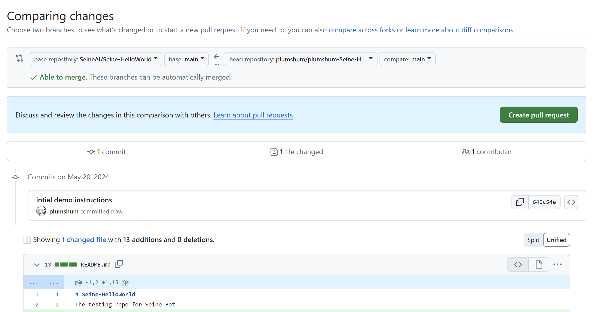
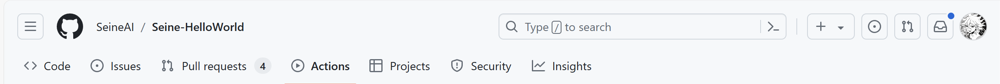
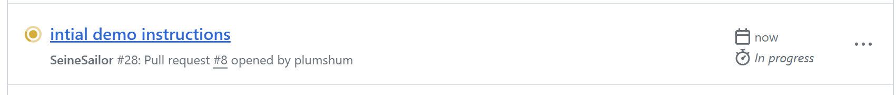
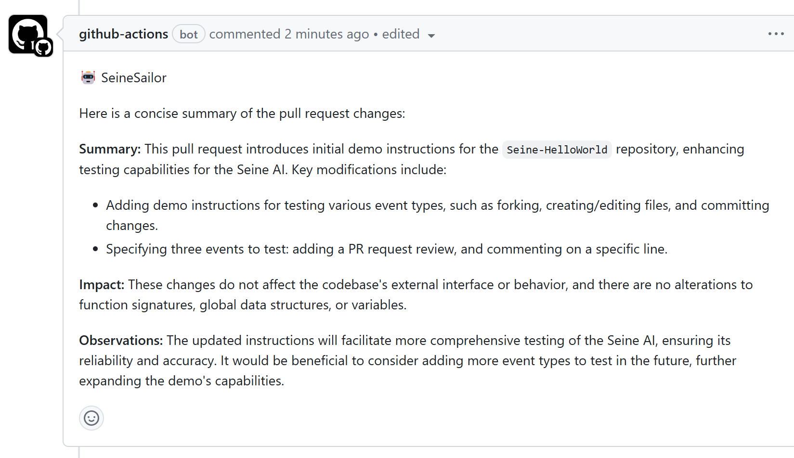

# Seine-HelloWorld
The testing repo for Seine Bot

# Assignment 1 (5/19/24) Test Event Types for Seine AI

1. Fork this repository. Create/Edit a file of your choice.
2. Create a PR with your commmited changes
3. Test out the following event types:
 - add PR Request review
 - specific line comment review 

Demos below have more details:

*add PR request review should automatically run when you make a PR*

after you push your commits. on github (or remotely) create a new PR with your commited changes. Once you create the PR, the bot should automatically run.

now the bot should be activated on Github actions

yay! the bot has given me a review on my PR. review the pr and make sure it make sense with your code. 
